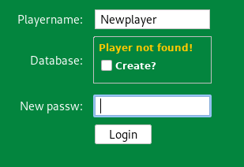

## Blackjack game

#### What is it?

A pretty basic implementation of the famous game BlackJack, written in JAVA using swing components, [SQLite](https://www.sqlite.org/index.html) as the internal database, [MigLayout](http://www.miglayout.com/) as the layout manager and [Flatlaf](https://www.formdev.com/flatlaf/) as a third-party look-and-feel provider.


To create a new player and start playing, just type a username you want to use and a `checkbox` will appear as soon as you start setting your password. Then tick the `checkbox` and click `Login`.



If the `checkbox` does not come out, that means the username already exists in the database.

#### Docker Image

If you are a JAVA GUI application & Docker master, feel free to try to help me fix the problem below which is preventing us from having a pretty cool and functioning Docker image of the game.

To download the image, simply run:

```
docker pull jrkrauss/blackjack:latest
```

To create and run the container, run:  

```
docker run -it -v /tmp/.X11-unix:/tmp/.X11-unix -e DISPLAY=$DISPLAY jrkrauss/blackjack:latest
```

P.S: This is the problem I mentioned before. The container execution exits with the error below:

```	No protocol specified
	Exception in thread "main" java.awt.AWTError: Can't connect to X11 window server using ':0' as the value of the DISPLAY variable.
	at java.desktop/sun.awt.X11GraphicsEnvironment.initDisplay(Native Method)
	at java.desktop/sun.awt.X11GraphicsEnvironment$1.run(X11GraphicsEnvironment.java:99)
	at java.base/java.security.AccessController.doPrivileged(AccessController.java:312)
	at java.desktop/sun.awt.X11GraphicsEnvironment.<clinit>(X11GraphicsEnvironment.java:58)
	at java.desktop/sun.awt.PlatformGraphicsInfo.createGE(PlatformGraphicsInfo.java:36)
	at java.desktop/java.awt.GraphicsEnvironment$LocalGE.createGE(GraphicsEnvironment.java:93)
	at java.desktop/java.awt.GraphicsEnvironment$LocalGE.<clinit>(GraphicsEnvironment.java:84)
	at java.desktop/java.awt.GraphicsEnvironment.getLocalGraphicsEnvironment(GraphicsEnvironment.java:106)
	at java.desktop/sun.awt.X11.XToolkit.<clinit>(XToolkit.java:232)
	at java.desktop/sun.awt.PlatformGraphicsInfo.createToolkit(PlatformGraphicsInfo.java:40)
	at java.desktop/java.awt.Toolkit.getDefaultToolkit(Toolkit.java:592)
	at java.desktop/java.awt.Toolkit.getEventQueue(Toolkit.java:1483)
	at java.desktop/java.awt.EventQueue.invokeLater(EventQueue.java:1312)
	at java.desktop/javax.swing.SwingUtilities.invokeLater(SwingUtilities.java:1421)
	at com.eca.assignment.main.Main.main(Main.java:11)
```